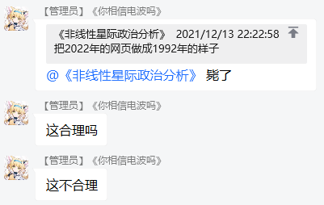
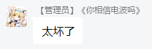
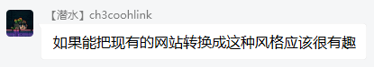
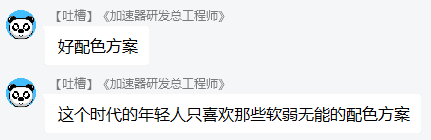
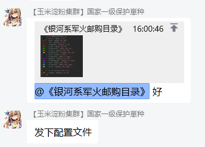

= Chui Design
author: Chuigda<icey@icey.tech>

前世代前端组件库

image::irrelevant/开幕雷击.png[开幕雷击]

== 介绍

锤哥的玩具级程序是一些小巧而简单的系统，数量少且功能简单，而且变动和并发很不频繁，不需要设计者与开发者能快速做出响应。同时这类玩具程序中有存在很多类似的页面以及组件，可以通过抽象得到一些不稳定且低复用性的内容。

随着社区玩具化的趋势，越来越多程序员对自己的轮子带来的虚荣心有了进一步的要求。带着这样的一个终极目标，我 (Chuigda WhiteGive) 经过大量 xjb 乱写，逐步打磨出一个服务于玩具级程序的设计体系 —— Chui Design。基于「复古」、「简约」、「不知道写啥」、「算了不编了」四大设计价值观，通过非模块化解决方案，增加冗余的造轮子成本，让设计者在造玩具轮子的时候能有更多可以折腾的东西。

=== 设计资源
我们不提供任何设计指引、最佳实践、设计资源和设计工具。

=== 前端实现
我们采用 React 封装了一套 Chui Design 的组件库，也欢迎社区其他框架的实现版本。

 - link:https://github.com/chuigda/chui-design[Chui Design of React] (官方实现)

=== 谁在使用
没有人。之后我可能会给自己博客系统用。

=== 社区评价
[.line-through]#因为没人使用，所以没有评价。# 虽然没人用过，但风格方面的评论还是有的。

=== 如何贡献
我不建议您以任何形式贡献，因为总的来讲这 *只会浪费您的时间*。不过如果您觉得有严重的问题需要修正，或者您在“使用”过程中遇到了困难，欢迎来 link:https://github.com/chuigda/chui-design/issues[Issues页面] 撕逼。
